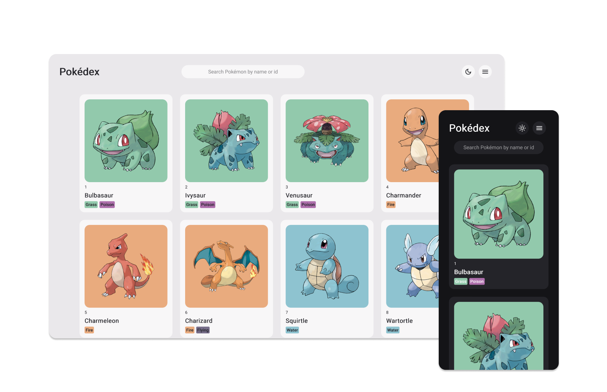

<h1 align="center">JavaScript Pokédex</h1>

    <a href="#project">Project</a>&nbsp;&nbsp;|&nbsp;&nbsp;
    <a href="#technologies">Technologies</a>&nbsp;&nbsp;|&nbsp;&nbsp;
    <a href="#license">License</a>&nbsp;&nbsp;|&nbsp;&nbsp;
    

    Explore nine generations of Pokémon with this simple and interactive JavaScript Pokédex. Integrated with <a href="https://pokeapi.co/">PokéApi</a>, it offers information to learn more about your favorite Pokémon.

## Features
<ul>
    <li>See information such as types, abilities, base stats and evolution of each Pokémon;</li>
    <li>Search Pokémon by name or id;</li>
    <li>Choose between nine generations of Pokémon;</li>
    <li>Dark and light theme.</li>
</ul>

## Usage

## Technologies
<ul>
    <li>PokéApi</li>
    <li>HTML</li>
    <li>CSS</li>
    <li>JavaScript</li>
</ul>

## License